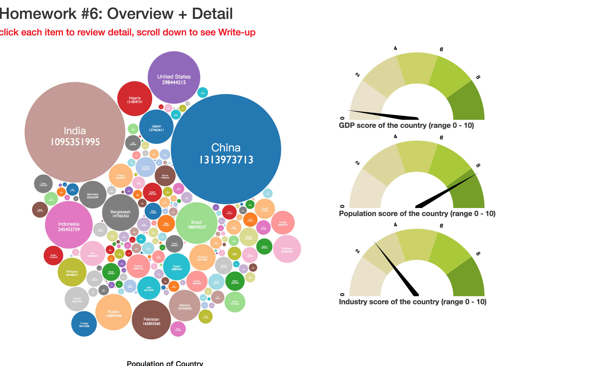

# My result

# Homework #6: Overview + Detail

In this assignment, you'll be creating two linked visualizations from scratch, with an emphasis on appropriate design choices and applying concepts that you've learned in lectures. The visualizations should follow the Visual Information Seeking Mantra: "overview first, zoom and filter, details on demand." In other words, one chart will be an overview, one will be a detail view, and there will be some sort of zoom and filter functionality that helps you go between them.

## Dataset

You'll be using the **Countries of the World** dataset in the data/ folder. The raw dataset is the `countries of the world.csv`, but a processed version exists in `countries_processed.csv` which you may use as a starting point. [Details about the dataset are available here](https://www.kaggle.com/fernandol/countries-of-the-world). You can choose which attributes about the data you'd like to visualize; there are no hard requirements in this regard, and you are not required to show all the data attributes, though you'll probably have to cover at least ~4-5 attributes based on the requirements below. 

> 🔍**Note**: Remember, attributes are not equal to data points (in this case, the countries are data points). At some level, all the countries should be reachable, either in the overview or detail visualizations.

## Requirements

The primary focus for this assignment is to 
1. Implement an intuitive overview+detail UI with two linked visualizations
2. Justify the visualization and interaction choices in your UI

"Intuitive" means that we should not have to read your write-up to undersand what is happening or how to use the interface. Therefore, make sure that you provide appropriate affordances and constraints (such as labels, legends, tooltips, etc.) for us to effectively use your visualizations to analyze/explore the data. If you need to, provide additional detail-on-demand or help functionality using tooltips. 

The two visualizations should cover different aspects of the data; there'll be some overlap (since you have to add some linking behavior), but your charts shouldn't show the same attributes twice. You may also only use 1 of the following chart types:

* Scatter plot
* Bar chart
* Pie chart
* Line chart
* Map

> 🔍**Note**: This constraint includes variants of these charts, i.e. _stacked bar chart_.

Interactions might include (but aren't limited to):
* Filtering (selecting data in one visualization to have it filter the other visualization, or simply filtering the data shown in one visualization using a control panel widget)
* Highlighting (interacting with data in one visualization to highlight a selection in the other visualization) 

Regardless of the exact visualizations you choose, you should have some way to go from an overview to a detail by interacting directly with the overview visualization. In other words, don't update the detail view by using a control panel, you should instead directly interact with the overview chart, by means of clicking, hovering, lassoing, scrubbing an axis, etc.

Your two charts should be organized side-by-side on your page: overview on the left, detail on the right, with optional control panels placed wherever necessary. Below this UI, you'll include a brief writeup that justifies the design decisions that you made. Please organize and format this nicely - I recommend reusing the CSS styling/layout from homework #1 Tableau.

## Writeup

Your writeup should include the following sections, with brief explanations for each (~1-5 sentences for each section). These sections are organized according to the nested design model. You can review Lectures #3 and #4 (in the Files tab in Canvas) to review definitions for things like data types, attribute types, task {action, target} pairs, marks and channels, and channel criteria.

* **Domain abstraction**: 
  * Who are the potential users of this UI?
* **Data abstraction**: 
  * What is the data type of the dataset?
  * For each attribute that is visualized, classify it according to its attribute type. Be as detailed as necessary: for example, there are two types of ordered data (ordinal, quantitative) as well as 3 possible ordering directions.
  * If you did additional data pre-processing or wrangling prior to visualizing it, describe what you did.
* **Task abstraction**: 
  * Your interface should support at least 2 tasks. What are they? For each task, describe it as an {action-target} pair, and state why this task is interesting (or pertinent) as regards to the dataset.
* **Visualization and Interaction abstraction**:
  * What are the visualizations that are shown in the UI? What are the marks and channels in each chart?
  * How do the visualizations/interactions support your task {action-target} pairs?
  * Justify why you chose these spefific chart types and channel encodings. 
* **Algorithm abstraction**:
  * If your UI contains any algorithms (e.g., clustering, map projections, binning, etc.), briefly describe how they support the visualizations/interactions.

## Grading

Your UI and writeup should be in a single `index.html` webpage. Make sure all necessary files are uploaded in your repo. Grading will be based off a combination of (1) a working UI that provides interesting and capable analysis of the data and follows the Visual Information-Seeking Mantra and (2) your writeup. This assignment is worth 10 points.
